# Dataflow Gen2 ingestion walkthrough

This exercise documents how I built a simple ingestion flow in Microsoft Fabric using a dataflow and a pipeline. The goal was to bring a CSV file into a Lakehouse and confirm the data was loaded correctly.

---

## Learning objective

I used a Fabric workspace, created a Lakehouse, and then built a Dataflow Gen2 to pull data from a public CSV file, transform it, and load it into the Lakehouse. After that, I added the dataflow into a Data Pipeline and ran it to validate the end-to-end process.

---

## Reference material

- [mslearn-fabric](https://microsoftlearning.github.io/mslearn-fabric)
- [Dataflow Gen2 lab](https://microsoftlearning.github.io/mslearn-fabric/Instructions/Labs/05-dataflows-gen2.html)

---

## How I did it

### 1. Started with a Fabric workspace

I opened the Microsoft Fabric portal and created a workspace with a supported capacity so the lab environment could run properly.

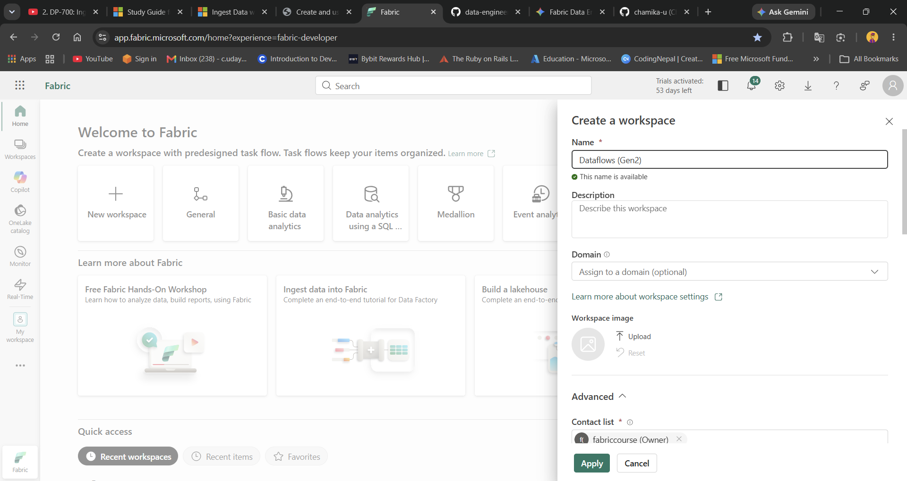

### 2. Created the project workspace

I set up the workspace and prepared the environment where the Lakehouse and dataflow would live.

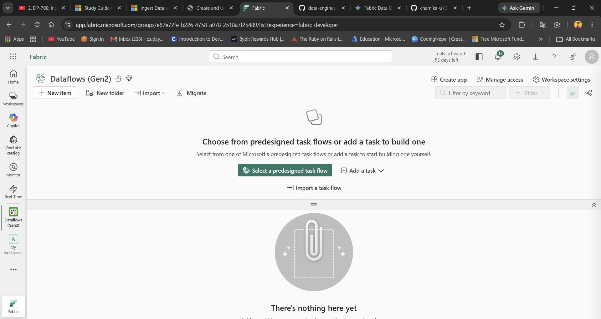

### 3. Created a new Lakehouse

From the workspace, I created a Lakehouse to act as the destination for the ingested data.

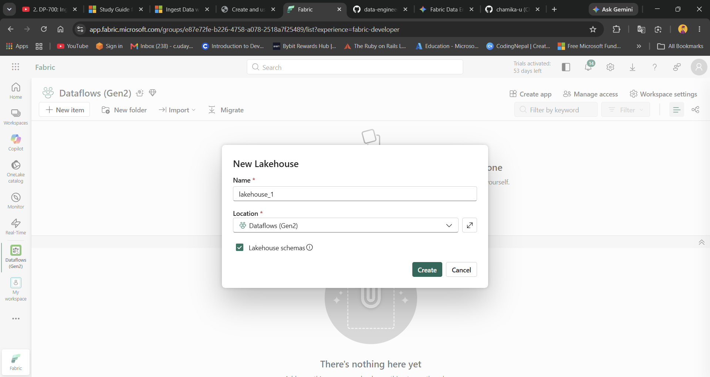

### 4. Opened the Lakehouse and created the dataflow

I went into the Lakehouse and started a new Dataflow Gen2 so I could connect to the source file and begin the ETL process.

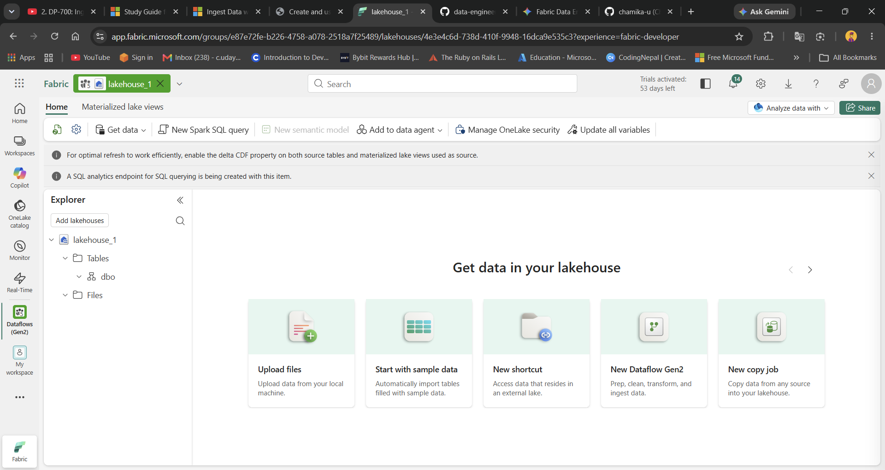

### 5. Connected to the CSV file

I selected the CSV source and used the public GitHub file URL for the sample dataset. The connection was created as an anonymous source so Power Query could read the data.

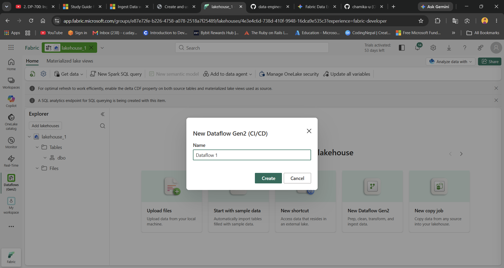

### 6. Reviewed the raw dataset in Power Query

I previewed the file and checked that the columns and values looked correct before making any transformations.

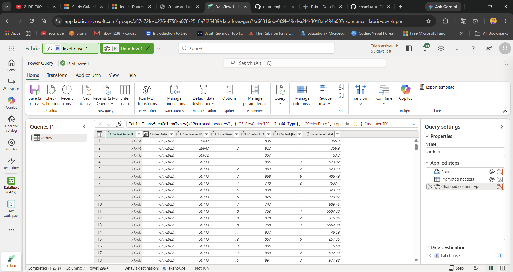

### 7. Added a transformation step

I added a custom column to calculate the month number from the order date. This helped create a new analytical field for later use.

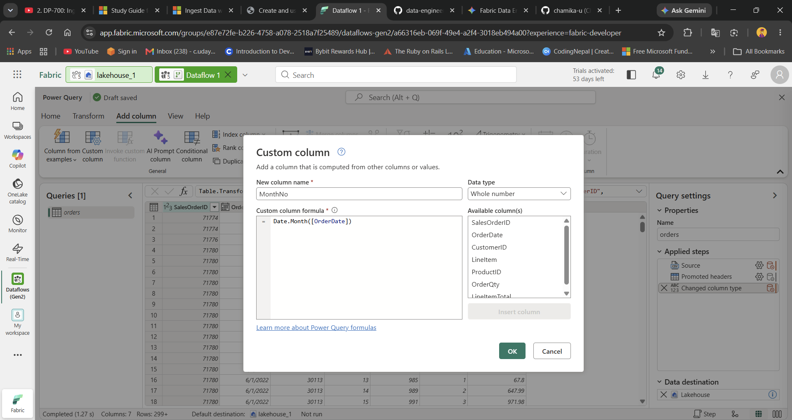

### 8. Verified the transformation result

I checked the output of the new column and confirmed the data was being transformed as expected inside the Power Query editor.

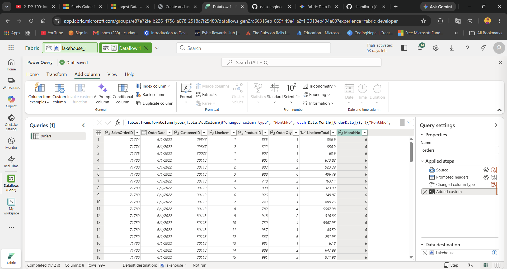

### 9. Confirmed the query logic

I reviewed the applied steps and ensured the custom logic was included in the transformation sequence.

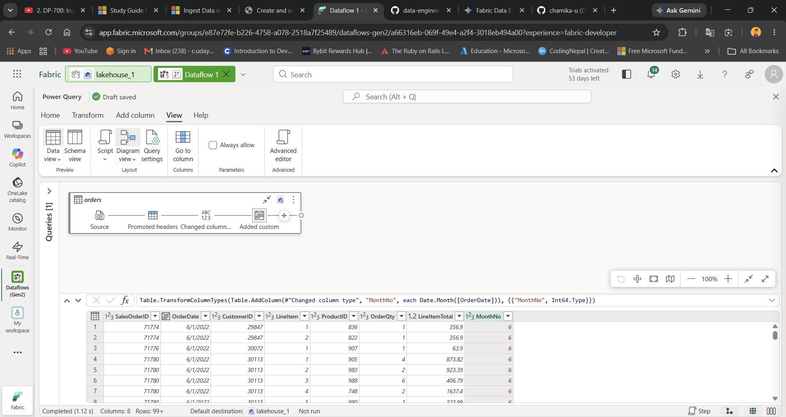

### 10. Set the Lakehouse as the destination

I configured the data destination so the transformed output would load into the Lakehouse table instead of staying in a temporary query.

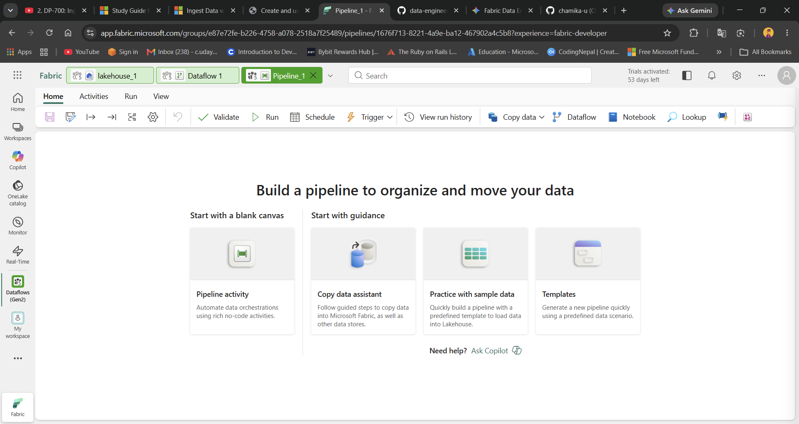

### 11. Selected the target Lakehouse and table name

I defined the target workspace and Lakehouse and named the resulting table `orders`.

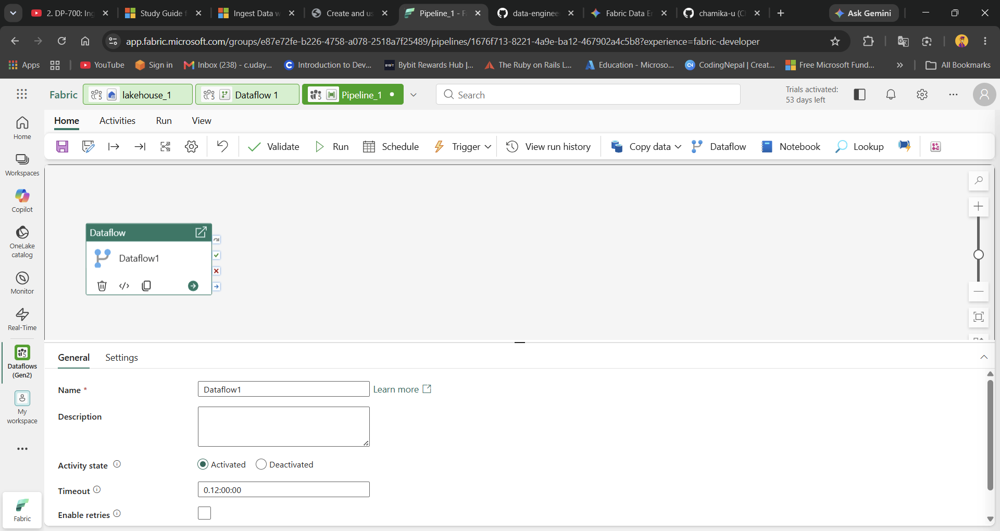

### 12. Applied the destination settings

I saved the destination configuration and selected the append option so new rows could be written into the target table.

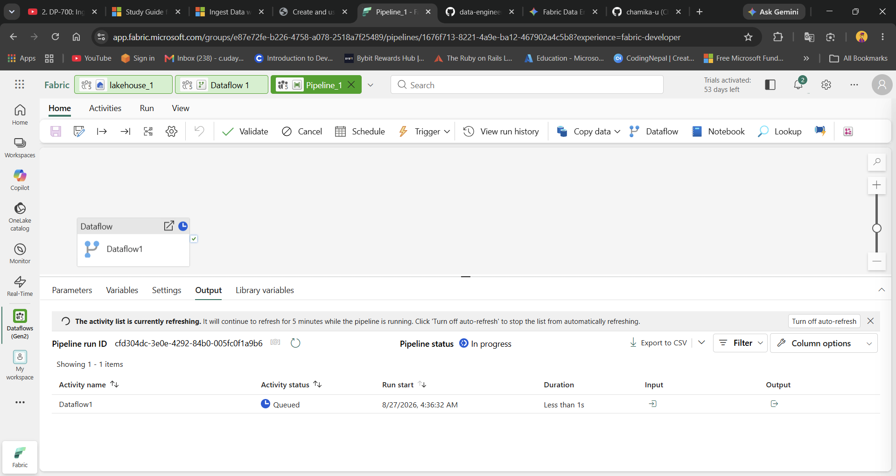

### 13. Saved and ran the dataflow

I saved the configuration and executed the dataflow so the transformation and loading process could run successfully.

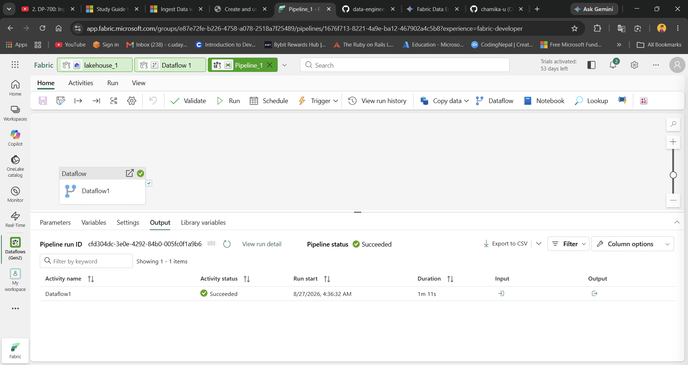

### 14. Added the dataflow to a pipeline

I created a data pipeline, added a Dataflow activity, and connected it to the dataflow I had just built so the ingestion process could be orchestrated.

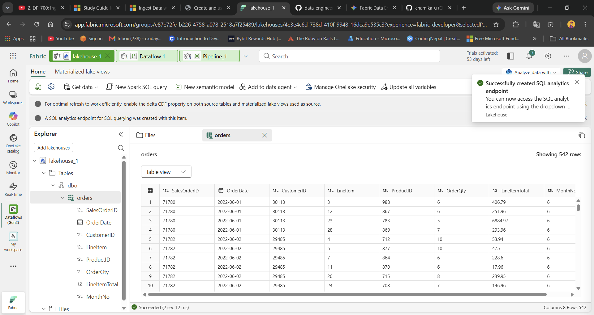

### 15. Ran the pipeline and validated the result

I executed the pipeline and checked the Lakehouse tables to confirm that the `orders` table was created and populated with the expected data.

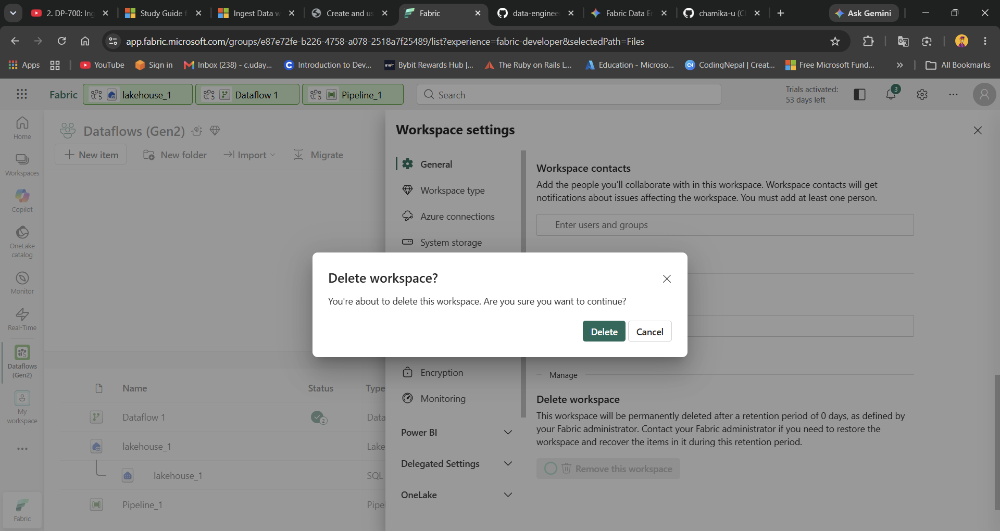

---

## Outcome

The final result was a successful ingestion workflow where a CSV file was imported, transformed, and loaded into the Lakehouse through a Dataflow Gen2 and executed through a Data Pipeline. This was a strong hands-on example of building a simple end-to-end data ingestion process in Microsoft Fabric.

---

## Key learning

This exercise helped me understand how low-code ETL in Fabric works in practice:

- source data can be ingested from external files
- transformations can be built visually in Power Query
- the Lakehouse acts as the analytical destination
- Pipelines add orchestration and operational control
- the loaded table becomes ready for downstream analysis and reporting

---

## Clean-up

Once the exercise was complete, the environment could be cleaned up by deleting the workspace from the Fabric portal if it was no longer needed.
